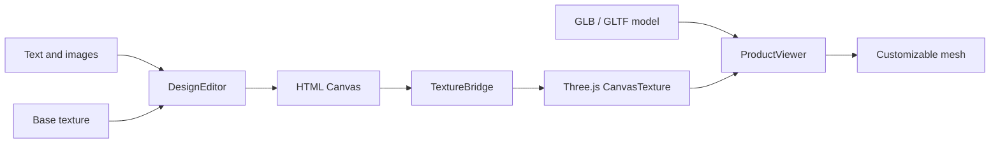

<div align="center">

# CustomForge

**Turn a 2D texture canvas into a live 3D product preview**

A lightweight, framework-agnostic prototype for building browser-based product customization experiences with Fabric.js and Three.js

<p>
  
  
  
  
  
</p>

<p>
  <strong>English</strong> |
  <a href="./README.zh-CN.md">中文简体</a>
</p>

</div>

---

## What It Does

CustomForge connects a familiar 2D design surface to a UV-mapped 3D model:

- Add and edit text on a 2D texture canvas
- Upload, move, scale, and rotate images
- Preview every canvas change on a 3D product in real time
- Load remote GLB/GLTF models and optional base textures
- Select the customizable surface by mesh name
- Rotate and zoom the 3D preview with OrbitControls
- Export the composed texture as a PNG

The included workbench starts with a procedural cup, so the project works immediately without external assets

## Quick Start

Requirements: Node.js 22+ and pnpm 11+

```bash
pnpm install
pnpm dev
```

Open the URL printed by Vite

The built-in demo appears with a UV workspace on the left and a live 3D preview on the right

## Load Your Product

Choose **Load remote** in the demo and provide:

| Field | Purpose |
| --- | --- |
| GLB / GLTF URL | URL of the UV-mapped 3D product model |
| Base texture URL | Optional image shown underneath editable objects |
| Customizable mesh | Name of the mesh that receives the live canvas texture |
| Flip texture vertically | Corrects texture orientation when required by the model |

UV coordinates are expected to be stored in the 3D model

The optional texture image is the visual base layer, not a replacement for model UV data

> [!IMPORTANT]
> Remote models, textures, decals, and fonts must be served with CORS headers that allow the app origin
>
> A blocked or canvas-tainting resource may fail to load and can prevent PNG export

## Basic Usage

The framework-independent source entry is [`src/index.ts`](./src/index.ts)

It can be mounted into any two DOM containers:

```html
<div id="texture-editor"></div>
<div id="product-viewer"></div>
```

```ts
import { createCustomizer } from './src'

const customizer = await createCustomizer({
  editor: '#texture-editor',
  viewer: '#product-viewer',
  editorWidth: 1024,
  editorHeight: 512,
  product: {
    modelUrl: 'https://example.com/product.glb',
    textureUrl: 'https://example.com/base-texture.png',
    surfaceMesh: 'PrintArea',
    textureFlipY: false,
  },
})

customizer.addText({
  text: 'Hello world',
  x: 120,
  y: 180,
  fontSize: 64,
  color: '#172126',
})

await customizer.addImage({
  src: 'https://example.com/logo.png',
  x: 720,
  y: 240,
  width: 220,
})
```

This repository does not publish an npm package or standalone library bundle yet

The current Vite build produces the demo application; `src/index.ts` is the intended future library boundary

## Instance API

| Method | Description |
| --- | --- |
| `addText(options)` | Add and select an editable text object |
| `addImage(options)` | Load, add, and select an image object |
| `deleteSelected()` | Remove the active object or selection |
| `loadProduct(product)` | Replace the model, base texture, and target mesh |
| `exportTexture(filename?)` | Download the composed texture as PNG |
| `resetView()` | Restore the default 3D camera position |
| `on(event, listener)` | Subscribe to instance events; returns an unsubscribe function |
| `destroy()` | Release DOM events, Fabric state, and WebGL resources |

Available events are `ready`, `change`, `selectionchange`, `status`, and `error`

## Architecture



```text
ProductCustomizer
|-- DesignEditor      Fabric.js rendering and object interaction
|-- ProductViewer     Three.js scene, model, material, and camera
`-- TextureBridge     Canvas-to-material synchronization
```

`ProductCustomizer` coordinates the modules while keeping Fabric.js and Three.js details behind a small instance API

The demo UI uses Vanilla TypeScript; the core does not depend on Vue, React, or another UI framework

## Model Contract

The current prototype expects:

- A GLB or GLTF model with valid UV coordinates
- An uncompressed model that can be loaded by the standard Three.js `GLTFLoader`
- A named mesh for the customizable surface, such as `PrintArea`
- The target texture in the first material slot of that mesh
- Remote asset URLs accessible under the browser's CORS policy

The built-in demo follows the same `PrintArea` mesh convention

## Project Structure

```text
src/
|-- bridge/           Canvas and Three.js texture synchronization
|-- core/             Public types, configuration, and DOM helpers
|-- customizer/       Public instance orchestration
|-- demo/             Runnable workbench UI
|-- editor/           Fabric.js design surface
|-- viewer/           Three.js product preview
`-- index.ts          Framework-independent source entry
```

## Development Commands

```bash
pnpm check       # TypeScript project check
pnpm test        # Unit tests
pnpm build       # Type-check and production build
pnpm preview     # Preview the production build
```

## Current Scope

This is an early technical prototype

The public API and design document format are not stable yet

The current milestone intentionally focuses on one texture and one customizable mesh

Multi-surface products, undo/redo, design serialization, framework adapters, and a distributable package are outside the present scope

## Technology

- [Fabric.js](https://fabricjs.com/) for the 2D editing surface
- [Three.js](https://threejs.org/) for model loading and real-time 3D rendering
- [Vite](https://vite.dev/) for development and application builds
- [TypeScript](https://www.typescriptlang.org/) with strict checking enabled

## License

CustomForge is licensed under the Apache License 2.0

See [LICENSE](./LICENSE) for the full license terms

Third-party dependencies and assets remain subject to their respective licenses
