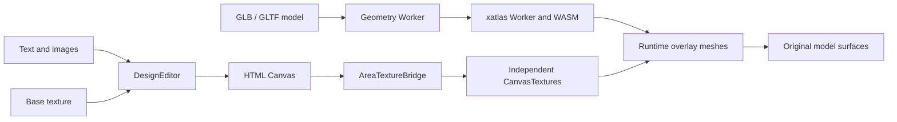

<div align="center">


<h1>CustomForge</h1>

<hr>

<p><strong>Turn a 2D texture canvas into a live 3D product preview</strong></p>

<p>A lightweight, framework-agnostic toolkit for building browser-based product customization experiences with Fabric.js and Three.js</p>

<p>
  <strong>English</strong>
  <span> · </span>
  <a href="./README.zh-CN.md">简体中文</a>
</p>

<p>
  
  
  
  
  
</p>

</div>

---

## What It Does

CustomForge turns a supported static 3D model into one or more browser-based design surfaces:

- Add and edit text on a 2D texture canvas
- Upload, move, scale, and rotate images
- Preview every canvas change on a 3D product in real time
- Load remote GLB/GLTF models or a local self-contained GLB file
- Analyze model geometry and generate candidate design areas without requiring existing UVs or a named mesh
- Parameterize each candidate with xatlas in a Worker while preserving the original model materials
- Switch, zoom, pan, and independently edit multiple design areas
- Rotate and zoom the 3D preview with OrbitControls
- Export the composed texture as a PNG
- Save and restore editable objects through versioned Design JSON
- Organize objects through names, visibility, locking, and layer order
- Undo and redo design changes through snapshot history
- Use configurable typography, background, and decorative asset Dialogs
- Adapt the default Workbench with branding, labels, theme tokens, and icons

The included workbench starts with a procedural cup, so the project works immediately without external assets

## Repository Development

Requirements: Node.js 22+ and pnpm 11+

```bash
pnpm install
pnpm dev
```

Open the URL printed by Vite

The built-in demo appears with a UV workspace on the left and a live 3D preview on the right

## npm Alpha Package

CustomForge is available from the npm Registry under the `alpha` dist-tag and the API and Design JSON Schema may change between alpha versions

Install the current public alpha with:

```powershell
pnpm add customforge@alpha
```

Fabric.js, Three.js, and the xatlas runtime are installed automatically as transitive dependencies

pnpm may report that the optional native `canvas` build script was ignored

CustomForge runs in the browser and does not use Node native canvas, so `pnpm approve-builds` is not required

Consumer projects can explicitly acknowledge this browser-only choice in `package.json`:

```json
{
  "pnpm": {
    "ignoredBuiltDependencies": ["canvas"]
  }
}
```

Package page: [npmjs.com/package/customforge](https://www.npmjs.com/package/customforge)

For repository-independent verification before publishing, build and create the local package from the repository root:

```powershell
pnpm pack:local
```

The command builds JavaScript, TypeScript declarations, and public styles, checks the npm file list, and creates:

```text
customforge-0.1.0-alpha.2.tgz
```

Install that local package in an independent Vite TypeScript project:

```powershell
pnpm add D:\projects\3DRendering\core_code\customforge-0.1.0-alpha.2.tgz
```

The checked-in `examples/npm-consumer` project imports CustomForge only through this `.tgz`. Run `pnpm install --ignore-workspace` in that directory so pnpm installs it independently from the parent workspace

## Load Your Product

Choose **Load product** in the demo. Automatic mode is selected by default:

| Field | Purpose |
| --- | --- |
| GLB / GLTF URL | URL of a supported static triangle model |
| Local GLB file | Self-contained `.glb` selected from the current device |
| Design area mode | Automatic geometry processing or existing-UV compatibility |
| Base texture URL | Optional image shown underneath editable objects |
| Design guide template URL | Optional SVG / PNG shown only in the editor and excluded from texture and PNG output |
| Customizable mesh | Existing-UV mode only: mesh that receives the live texture |
| Flip texture vertically | Existing-UV mode only: corrects model texture orientation |
| Show UV island boundaries | Automatically displays UV island boundaries from the target mesh |

In automatic mode, CustomForge analyzes static mesh geometry in its own Worker, generates local UV charts with the bundled xatlas Worker and WASM module, and adds transparent runtime overlay meshes. It does not rewrite the uploaded GLB or replace the source materials

Before xatlas starts, CustomForge fetches and validates the packaged WASM asset in the page context, then exposes it to the Worker through a local `application/wasm` Blob URL. A failed request, invalid response, or initialization that exceeds 15 seconds rejects product loading with an explicit error instead of leaving processing at 0%

The highest-scoring area opens first. The Workbench selector, previous/next controls, and 3D surface-selection mode switch among generated candidates. Surface selection currently chooses an existing candidate that contains the clicked triangle, or the best candidate on that mesh; it does not grow a new arbitrary region from the click yet

Existing-UV mode remains available for professionally prepared models. It requires a named mesh with valid UVs and directly applies the editor texture to that mesh

> [!IMPORTANT]
> Remote models, textures, decals, and fonts must be served with CORS headers that allow the app origin
>
> A blocked or canvas-tainting resource may fail to load and can prevent PNG export

## Basic Usage

The framework-independent Library entry can be mounted into any two DOM containers:

CustomForge is browser-only and must be initialized after its DOM containers are available

The editor and viewer require two different containers; call `destroy()` when the page, host component, or instance is no longer in use to release Fabric, WebGL, observer, and event resources

```html
<div id="texture-editor"></div>
<div id="product-viewer"></div>
```

```ts
import { createCustomizer } from 'customforge'
import 'customforge/style.css'

const customizer = await createCustomizer({
  editor: '#texture-editor',
  viewer: '#product-viewer',
  editorWidth: 1024,
  editorHeight: 512,
  product: {
    modelUrl: 'https://example.com/product.glb',
    designAreas: {
      mode: 'auto',
      maxAreas: 4,
      textureSize: 1024,
      strategy: 'balanced',
    },
    designGuide: {
      showUv: true,
    },
  },
})

customizer.addText({
  text: 'Hello world',
  x: 120,
  y: 180,
  fontSize: 64,
  color: '#172126',
})

await customizer.addImage({
  src: 'https://example.com/logo.png',
  x: 720,
  y: 240,
  width: 220,
})

window.addEventListener('beforeunload', () => customizer.destroy(), {
  once: true,
})
```

The public package uses the same root and style imports as the local `.tgz`; pin an exact alpha version when reproducible installs are required

## Ready-made Workbench

Use the optional Workbench entry when a complete default interface is preferable to building controls from scratch

The host element must have an explicit height so the design surface, layers, and 3D preview can measure their available space

```html
<div id="customforge-workbench" style="height: 720px"></div>
```

```ts
import { createWorkbench } from 'customforge/workbench'
import 'customforge/style.css'

const workbench = await createWorkbench({
  container: '#customforge-workbench',
  product: {
    modelUrl: 'https://example.com/product.glb',
  },
  features: {
    presetBackgrounds: true,
    presetElements: true,
  },
  layout: {
    header: true,
    layers: true,
  },
  branding: {
    logoUrl: '/brand/logo.png',
    title: 'Studio',
    subtitle: 'Product personalization',
  },
  labels: {
    addText: 'Typography',
    addImage: 'Artwork',
  },
  theme: {
    accent: '#0057b8',
    accentHover: '#003f87',
    accentContrast: '#ffffff',
  },
  assets: {
    backgrounds: [
      { id: 'floral', name: 'Floral', url: '/presets/floral.png' },
    ],
    elements: [
      { id: 'flower', name: 'Flower', url: '/presets/flower.png' },
    ],
  },
})
```

The bundled CustomForge logo is used by default and can be replaced or hidden through `branding`

`labels` replaces visible Workbench copy, `theme` maps to scoped CSS variables, and `icons` can disable built-in icons or replace individual semantic icons with image URLs

The default UI font stack prefers the rounded `Nunito Sans` family and falls back to system sans-serif fonts

CustomForge bundles the font asset and does not fetch third-party font services at runtime

Text and image commands open focused Dialogs instead of immediately mutating the canvas

- The text Dialog includes an input, color control, and replaceable typography presets
- The image Dialog includes local upload, background presets, and decorative element presets
- A design background replaces the previous design background, fills the canvas, starts locked at the bottom layer, and persists in Design JSON
- The product Dialog accepts either a remote URL or local GLB and exposes automatic/existing-UV modes
- The editor header switches areas and offers zoom in, zoom out, fit, 100%, wheel zoom, middle-button drag, and Space+drag panning; 100% preserves the current pan while fit recenters the canvas

Feature and layout switches can also be changed after initialization

```ts
workbench.setFeature('addText', true)
workbench.setLayout('header', true)
```

| Feature switch | Controls |
| --- | --- |
| `addText`, `addImage`, `deleteSelection` | Object Dialogs and deletion |
| `undoRedo` | Undo and redo buttons plus Workbench keyboard shortcuts |
| `saveDesign`, `loadDesign` | Design JSON actions |
| `loadRemoteProduct`, `exportTexture`, `resetView` | Product and output actions |
| `designGuide` | Product template, UV, safe-area, and bleed-area guide toggle |
| `designAreas` | Area selector and previous/next controls |
| `editorViewport` | Zoom, fit, and 100% editor controls |
| `surfacePick` | Candidate selection from the 3D surface |
| `reorderObjects`, `toggleObjectVisibility`, `lockObjects`, `renameObjects` | Layer management |
| `presetBackgrounds`, `presetElements` | Image Dialog preset tabs |

| Layout switch | Region |
| --- | --- |
| `header` | Brand and global product actions |
| `editorHeader`, `viewerHeader` | Workspace panel headings |
| `toolbar` | Design tool controls |
| `layers` | Object layer panel |
| `status` | Runtime status and object count |

All feature and layout values default to `true`

Feature switches only control the built-in Workbench controls and do not remove methods from `workbench.customizer`

Theme values are intended for coherent product-level styling rather than per-button color configuration

```ts
const workbench = await createWorkbench({
  container: '#customforge-workbench',
  icons: {
    enabled: true,
    sources: {
      addText: '/icons/typography.svg',
      exportTexture: null,
    },
  },
  textPresets: [
    {
      id: 'brand-display',
      name: 'Brand display',
      fontFamily: 'Arial',
      fontSize: 72,
      width: 460,
      color: '#17191c',
    },
  ],
})
```

## Design JSON

`saveDesign()` returns a Library-owned, JSON-safe document instead of exposing Fabric.js serialization. `loadDesign()` validates unknown input and restores the editable object stack asynchronously:

```ts
const design = customizer.saveDesign()
localStorage.setItem('customforge-design', JSON.stringify(design))

const savedDesign = localStorage.getItem('customforge-design')
if (savedDesign) {
  await customizer.loadDesign(JSON.parse(savedDesign))
}
```

`saveDesign()` now returns product Design JSON version `2`. It stores the model fingerprint, automatic processor version, active area, and every area's independent version 1 canvas document. Objects remain ordered back to front and include stable IDs, names, visibility, locking, image roles, and center-based transforms

Version 2 intentionally excludes model bytes, source materials, and base textures. Loading requires matching logical canvas dimensions, automatic processor version, model fingerprint, area IDs, and area fingerprints so a design cannot silently move onto a different model or processing result

An image with `role: 'background'` is a design object rather than the product base texture. Only one is allowed, it must be the first object, and older version 1 documents without `role` continue to load as ordinary image elements

Loading is transactional across all areas: the previous canvases, active area, viewport, guide, textures, and history are restored if validation or an image load fails. Blob URL images are converted to Data URLs when added; remote image URLs remain URLs and must continue to satisfy browser CORS requirements when restored

Older version 1 single-canvas documents are still accepted and load into the currently active area. Saving again produces version 2. This is the migration path for designs created before automatic multi-area support

The Schema is still an alpha contract and may change in later alpha versions

## Product Design Guides

`product.designGuide` adds positioning information to the 2D editor without including it in final output:

- `showUv` defaults to true and extracts UV island boundaries without drawing shared triangle edges
- `templateUrl` accepts a transparent full-canvas SVG or PNG; remote URLs require CORS access
- `safeArea` draws a dashed recommendation for important content
- `bleedArea` draws a solid boundary that includes trimming allowance
- `visible` controls whether the guide is shown when the product first loads

`safeArea` and `bleedArea` use normalized `0-1` coordinates and are independent of editor resolution. They remain visual guides and do not constrain objects. In automatic mode, only the candidate triangles exist in the runtime overlay, so transparent pixels and content outside its generated UV chart do not alter unrelated model surfaces

```ts
customizer.setDesignGuideVisible(false)
console.log(customizer.isDesignGuideVisible())
```

Omit `designAreas` to use the same automatic defaults whenever a model is supplied without `surfaceMesh`. To keep the original direct-UV behavior, opt in explicitly:

```ts
await customizer.loadProduct({
  modelUrl: 'https://example.com/prepared-product.glb',
  surfaceMesh: 'PrintArea',
  designAreas: { mode: 'existing-uv' },
  textureFlipY: false,
})
```

## Undo and Redo

History is enabled in both the headless core and Workbench and defaults to 50 undo steps

Set `historyLimit` in `createCustomizer` or `createWorkbench` options to change the retained undo depth

```ts
if (customizer.canUndo()) {
  await customizer.undo()
}

await customizer.redo()
customizer.clearHistory()

const stop = customizer.on('historychange', ({ canUndo, canRedo }) => {
  console.log({ canUndo, canRedo })
})
```

History covers object creation, deletion, canvas transforms, text edits, layer order, names, visibility, locking, and Design JSON loading. Each design area retains its own undo and redo stack when another area is selected

Workbench also supports `Ctrl` or `Cmd` + `Z`, `Ctrl` or `Cmd` + `Shift` + `Z`, and `Ctrl` + `Y` while focus is outside form fields

Successful product replacement keeps the current design but starts a new history baseline

## Instance API

| Method | Description |
| --- | --- |
| `addText(options)` | Add and select editable text, constrained to the canvas |
| `addImage(options)` | Load and select an element or replace the design background |
| `getObjects()` | Return the current objects in back-to-front layer order |
| `getSelectedObjectIds()` | Return stable IDs for the current selection |
| `selectObject(id)` | Select a visible object by stable ID |
| `removeObject(id)` | Remove an object by stable ID |
| `moveObject(id, index)` | Move an object to a zero-based layer index |
| `renameObject(id, name)` | Change the object name shown in layer tools |
| `setObjectVisibility(id, visible)` | Include or exclude an object from rendering |
| `setObjectLocked(id, locked)` | Lock or unlock canvas transformations |
| `isDesignGuideVisible()` | Check whether the product design guide is visible |
| `setDesignGuideVisible(visible)` | Show or hide the product design guide |
| `getDesignAreas()` | Return the generated areas and quality metrics |
| `getActiveDesignAreaId()` | Return the area currently loaded in the editor |
| `setActiveDesignArea(areaId)` | Save the current area and restore another area |
| `isSurfacePickAllowed()` | Check whether the current product allows candidate selection from the 3D surface |
| `beginSurfacePick()`, `cancelSurfacePick()` | Start or stop candidate selection from the 3D model |
| `getEditorViewport()` | Return the active area's zoom and pan state |
| `setEditorViewport(viewport)` | Set display-only zoom and pan without changing output coordinates |
| `fitActiveDesignArea()` | Fit the active area and clear display panning |
| `deleteSelected()` | Remove the active object or selection |
| `saveDesign()` | Return the current versioned Design JSON document |
| `loadDesign(value)` | Validate and transactionally restore Design JSON |
| `canUndo()`, `canRedo()` | Query the current history directions |
| `undo()`, `redo()` | Restore the previous or next design snapshot |
| `clearHistory()` | Make the current design the new history baseline |
| `loadProduct(product)` | Replace the model, base texture, and target mesh |
| `exportTexture(filename?)` | Download the composed texture as PNG |
| `resetView()` | Restore the default 3D camera position |
| `on(event, listener)` | Subscribe to instance events; returns an unsubscribe function |
| `destroy()` | Release DOM events, Fabric state, and WebGL resources |

Available events are `ready`, `change`, `selectionchange`, `historychange`, `designguidechange`, `processingprogress`, `designareaschange`, `activeareachange`, `surfacepickchange`, `editorviewportchange`, `status`, and `error`

The initial alpha stability boundary is limited to the methods above, `createCustomizer`, `ProductCustomizer`, the `customforge/workbench` entry, and the configuration, event, Workbench, and Design JSON types exported from declared package entries

`ProductCustomizer` does not expose its Fabric.js editor or Three.js viewer instances; consumers interact through the facade API

Imports from `core`, `editor`, `viewer`, `bridge`, or any other undeclared package subpath are unsupported

## Architecture



```text
ProductCustomizer
|-- DesignEditor      Fabric.js rendering and object interaction
|-- Processing        geometry snapshots, Worker analysis, and xatlas UVs
|-- ProductViewer     Three.js scene, model, material, and camera
`-- AreaTextureBridge independent area Canvas-to-overlay synchronization
```

`ProductCustomizer` coordinates the modules while keeping Fabric.js and Three.js details behind a small instance API

The optional Workbench and demo use Vanilla TypeScript; the core does not depend on Vue, React, or another UI framework

## Model Contract

Automatic mode currently supports:

- Static triangle `Mesh` geometry; original UV coordinates are optional
- Remote GLB/GLTF URLs or local self-contained GLB files
- Uncompressed resources loadable by the standard Three.js `GLTFLoader`
- Remote asset URLs accessible under the browser's CORS policy

`SkinnedMesh`, `InstancedMesh`, active morph-target deformation, local multi-file GLTF, and models that require unconfigured Draco or Meshopt decoders are not supported by the automatic path. Candidate input and generated overlay geometry are currently limited to 65,535 vertices by the selected xatlas wrapper

Existing-UV mode additionally requires a named triangle mesh with valid UVs and uses its first material slot. The built-in procedural demo follows this `PrintArea` compatibility path

## Project Structure

```text
src/
|-- bridge/           Canvas and Three.js texture synchronization
|-- core/             Public types, configuration, and DOM helpers
|-- customizer/       Public instance orchestration
|-- design-area/      Overlay geometry and xatlas parameterization
|-- demo/             Runnable workbench UI
|-- editor/           Fabric.js design surface and snapshot history
|-- processing/       Transferable geometry analysis and Worker lifecycle
|-- style.css         Public Library style entry
|-- styles/           Core and Workbench styles
|-- viewer/           Three.js product preview
|-- workbench/        Configurable UI, Dialogs, icons, and preset assets
`-- index.ts          Framework-independent source entry

examples/
`-- npm-consumer/     Independent local .tgz consumer

scripts/
`-- verify-package.mjs  npm file and artifact boundary checks
```

## Development Commands

```bash
pnpm check       # TypeScript project check
pnpm test        # Unit tests
pnpm build       # Type-check and production build
pnpm build:lib   # Build core and Workbench ESM, declarations, and styles
pnpm verify:package # Check dist and the npm file list
pnpm pack:local  # Build, verify, and create the local .tgz
pnpm release:check # Run checks, tests, package build, verification, and local pack
pnpm preview     # Preview the production build
```

## Current Scope

This is an early technical prototype

The public API and design document format are not stable yet

The current milestone implements automatic candidate generation, independent multi-area textures, per-area history, and Design JSON version 2 while preserving the existing-UV compatibility path

Public npm releases use the `alpha` dist-tag until the API and Design JSON contract are ready for a more stable channel

The current surface picker switches among generated candidates rather than growing a new region from every clicked triangle. Visibility sampling, distortion/overlap quality gates, persistent caching, touch pinch gestures, BVH acceleration, compressed-model decoders, and framework adapters remain future work

## Technology

- [Fabric.js](https://fabricjs.com/) for the 2D editing surface
- [Three.js](https://threejs.org/) for model loading and real-time 3D rendering
- [xatlas-three](https://github.com/repalash/xatlas-three) and [xatlasjs](https://github.com/repalash/xatlas.js) for Worker/WASM UV parameterization
- [Lucide](https://lucide.dev/) for bundled Workbench controls
- [Vite](https://vite.dev/) for development and application builds
- [TypeScript](https://www.typescriptlang.org/) with strict checking enabled

## License

CustomForge is licensed under the Apache License 2.0

See [LICENSE](./LICENSE) for the full license terms

Third-party dependencies and assets remain subject to their respective licenses

The bundled Nunito Sans font is licensed under the SIL Open Font License 1.1, available in [NunitoSans-OFL.txt](./LICENSES/NunitoSans-OFL.txt)

xatlas-three and xatlasjs are distributed under the MIT License; their texts are included in [xatlas-three-MIT.txt](./LICENSES/xatlas-three-MIT.txt) and [xatlasjs-MIT.txt](./LICENSES/xatlasjs-MIT.txt). The bundled Comlink code retains its Apache 2.0 notice in [Comlink-Apache-2.0-NOTICE.txt](./LICENSES/Comlink-Apache-2.0-NOTICE.txt)
