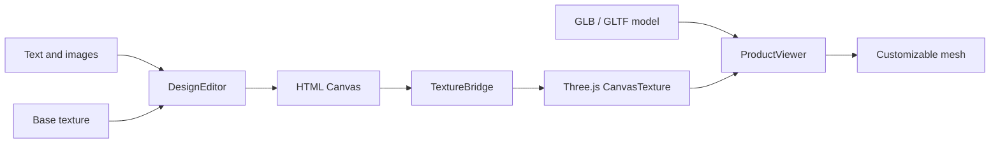

<div align="center">

# CustomForge

**Turn a 2D texture canvas into a live 3D product preview**

A lightweight, framework-agnostic prototype for building browser-based product customization experiences with Fabric.js and Three.js

<p>
  
  
  
  
  
</p>

<p>
  <strong>English</strong> |
  <a href="./README.zh-CN.md">中文简体</a>
</p>

</div>

---

## What It Does

CustomForge connects a familiar 2D design surface to a UV-mapped 3D model:

- Add and edit text on a 2D texture canvas
- Upload, move, scale, and rotate images
- Preview every canvas change on a 3D product in real time
- Load remote GLB/GLTF models and optional base textures
- Select the customizable surface by mesh name
- Rotate and zoom the 3D preview with OrbitControls
- Export the composed texture as a PNG
- Save and restore editable objects through versioned Design JSON

The included workbench starts with a procedural cup, so the project works immediately without external assets

## Repository Development

Requirements: Node.js 22+ and pnpm 11+

```bash
pnpm install
pnpm dev
```

Open the URL printed by Vite

The built-in demo appears with a UV workspace on the left and a live 3D preview on the right

## npm Alpha Package

CustomForge is available from the npm Registry under the `alpha` dist-tag and the API and Design JSON Schema may change between alpha versions

Install the current public alpha with:

```powershell
pnpm add customforge@alpha
```

Fabric.js and Three.js are installed automatically as transitive dependencies

pnpm may report that the optional native `canvas` build script was ignored

CustomForge runs in the browser and does not use Node native canvas, so `pnpm approve-builds` is not required

Consumer projects can explicitly acknowledge this browser-only choice in `package.json`:

```json
{
  "pnpm": {
    "ignoredBuiltDependencies": ["canvas"]
  }
}
```

Package page: [npmjs.com/package/customforge](https://www.npmjs.com/package/customforge)

For repository-independent verification before publishing, build and create the local package from the repository root:

```powershell
pnpm pack:local
```

The command builds JavaScript, TypeScript declarations, and core styles, checks the npm file list, and creates:

```text
customforge-0.1.0-alpha.1.tgz
```

Install that local package in an independent Vite TypeScript project:

```powershell
pnpm add D:\projects\3DRendering\core_code\customforge-0.1.0-alpha.1.tgz
```

The checked-in `examples/npm-consumer` project imports CustomForge only through this `.tgz`. Run `pnpm install --ignore-workspace` in that directory so pnpm installs it independently from the parent workspace

## Load Your Product

Choose **Load remote** in the demo and provide:

| Field | Purpose |
| --- | --- |
| GLB / GLTF URL | URL of the UV-mapped 3D product model |
| Base texture URL | Optional image shown underneath editable objects |
| Customizable mesh | Name of the mesh that receives the live canvas texture |
| Flip texture vertically | Corrects texture orientation when required by the model |

UV coordinates are expected to be stored in the 3D model

The optional texture image is the visual base layer, not a replacement for model UV data

> [!IMPORTANT]
> Remote models, textures, decals, and fonts must be served with CORS headers that allow the app origin
>
> A blocked or canvas-tainting resource may fail to load and can prevent PNG export

## Basic Usage

The framework-independent Library entry can be mounted into any two DOM containers:

CustomForge is browser-only and must be initialized after its DOM containers are available

The editor and viewer require two different containers; call `destroy()` when the page, host component, or instance is no longer in use to release Fabric, WebGL, observer, and event resources

```html
<div id="texture-editor"></div>
<div id="product-viewer"></div>
```

```ts
import { createCustomizer } from 'customforge'
import 'customforge/style.css'

const customizer = await createCustomizer({
  editor: '#texture-editor',
  viewer: '#product-viewer',
  editorWidth: 1024,
  editorHeight: 512,
  product: {
    modelUrl: 'https://example.com/product.glb',
    textureUrl: 'https://example.com/base-texture.png',
    surfaceMesh: 'PrintArea',
    textureFlipY: false,
  },
})

customizer.addText({
  text: 'Hello world',
  x: 120,
  y: 180,
  fontSize: 64,
  color: '#172126',
})

await customizer.addImage({
  src: 'https://example.com/logo.png',
  x: 720,
  y: 240,
  width: 220,
})

window.addEventListener('beforeunload', () => customizer.destroy(), {
  once: true,
})
```

The public package uses the same root and style imports as the local `.tgz`; pin an exact alpha version when reproducible installs are required

## Design JSON

`saveDesign()` returns a Library-owned, JSON-safe document instead of exposing Fabric.js serialization. `loadDesign()` validates unknown input and restores the editable object stack asynchronously:

```ts
const design = customizer.saveDesign()
localStorage.setItem('customforge-design', JSON.stringify(design))

const savedDesign = localStorage.getItem('customforge-design')
if (savedDesign) {
  await customizer.loadDesign(JSON.parse(savedDesign))
}
```

The current Schema version is `1`. It stores the logical canvas size and the text and image objects in back-to-front render order, including stable object IDs and center-based transforms

Design JSON intentionally excludes the product model, target mesh, and base texture. A document can only be loaded into an editor with exactly the same logical width and height

Loading is transactional: the current design remains unchanged unless the document validates and every referenced image loads successfully. Blob URL images are converted to Data URLs when added; remote image URLs remain URLs and must continue to satisfy browser CORS requirements when restored

The Schema is still an alpha contract and may change in later alpha versions

## Instance API

| Method | Description |
| --- | --- |
| `addText(options)` | Add and select editable text, constrained to the canvas |
| `addImage(options)` | Load and select an image, constrained to the canvas |
| `deleteSelected()` | Remove the active object or selection |
| `saveDesign()` | Return the current versioned Design JSON document |
| `loadDesign(value)` | Validate and transactionally restore Design JSON |
| `loadProduct(product)` | Replace the model, base texture, and target mesh |
| `exportTexture(filename?)` | Download the composed texture as PNG |
| `resetView()` | Restore the default 3D camera position |
| `on(event, listener)` | Subscribe to instance events; returns an unsubscribe function |
| `destroy()` | Release DOM events, Fabric state, and WebGL resources |

Available events are `ready`, `change`, `selectionchange`, `status`, and `error`

The initial alpha stability boundary is limited to the methods above, `createCustomizer`, `ProductCustomizer`, and the configuration, event, and Design JSON types exported from the package root

`ProductCustomizer` does not expose its Fabric.js editor or Three.js viewer instances; consumers interact through the facade API

Imports from `core`, `editor`, `viewer`, `bridge`, or any other undeclared package subpath are unsupported

## Architecture



```text
ProductCustomizer
|-- DesignEditor      Fabric.js rendering and object interaction
|-- ProductViewer     Three.js scene, model, material, and camera
`-- TextureBridge     Canvas-to-material synchronization
```

`ProductCustomizer` coordinates the modules while keeping Fabric.js and Three.js details behind a small instance API

The demo UI uses Vanilla TypeScript; the core does not depend on Vue, React, or another UI framework

## Model Contract

The current prototype expects:

- A GLB or GLTF model with valid UV coordinates
- An uncompressed model that can be loaded by the standard Three.js `GLTFLoader`
- A named mesh for the customizable surface, such as `PrintArea`
- The target texture in the first material slot of that mesh
- Remote asset URLs accessible under the browser's CORS policy

The built-in demo follows the same `PrintArea` mesh convention

## Project Structure

```text
src/
|-- bridge/           Canvas and Three.js texture synchronization
|-- core/             Public types, configuration, and DOM helpers
|-- customizer/       Public instance orchestration
|-- demo/             Runnable workbench UI
|-- editor/           Fabric.js design surface
|-- style.css         Public Library style entry
|-- styles/           Library core styles
|-- viewer/           Three.js product preview
`-- index.ts          Framework-independent source entry

examples/
`-- npm-consumer/     Independent local .tgz consumer

scripts/
`-- verify-package.mjs  npm file and artifact boundary checks
```

## Development Commands

```bash
pnpm check       # TypeScript project check
pnpm test        # Unit tests
pnpm build       # Type-check and production build
pnpm build:lib   # Build ESM, declarations, and core styles
pnpm verify:package # Check dist and the npm file list
pnpm pack:local  # Build, verify, and create the local .tgz
pnpm release:check # Run checks, tests, package build, verification, and local pack
pnpm preview     # Preview the production build
```

## Current Scope

This is an early technical prototype

The public API and design document format are not stable yet

The current milestone intentionally focuses on one texture and one customizable mesh

Public npm releases use the `alpha` dist-tag until the API and Design JSON contract are ready for a more stable channel

Multi-surface products, undo/redo, and framework adapters are not implemented yet. Undo/redo is the next planned milestone and will build on the Design JSON snapshot contract

## Technology

- [Fabric.js](https://fabricjs.com/) for the 2D editing surface
- [Three.js](https://threejs.org/) for model loading and real-time 3D rendering
- [Vite](https://vite.dev/) for development and application builds
- [TypeScript](https://www.typescriptlang.org/) with strict checking enabled

## License

CustomForge is licensed under the Apache License 2.0

See [LICENSE](./LICENSE) for the full license terms

Third-party dependencies and assets remain subject to their respective licenses
