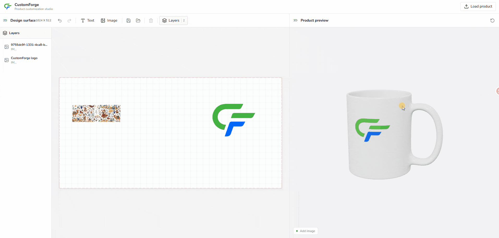
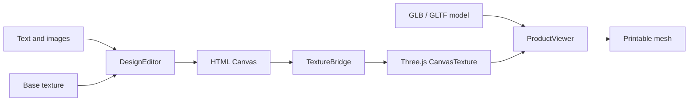

<div align="center">


<h1>CustomForge</h1>

<hr>

<p><strong>Turn a 2D texture canvas into a live 3D product preview</strong></p>

<p>A lightweight, framework-agnostic toolkit for building browser-based product customization experiences with Fabric.js and Three.js</p>

<p>
  <strong>English</strong>
  <span> · </span>
  <a href="./README.zh-CN.md">简体中文</a>
</p>

<p>
  
  
  
  
  
</p>

</div>

---

## Demo



## What It Does

CustomForge connects a familiar 2D design surface to a UV-mapped 3D model:

- Add and edit text on a 2D texture canvas
- Format selected text through an Office-style contextual toolbar
- Upload, move, scale, and rotate images
- Preview every canvas change on a 3D product in real time
- Load remote GLB/GLTF models and optional base textures
- Select the customizable surface by mesh name
- Display the target mesh UV printable region and boundary as a non-exported editor guide
- Rotate and zoom the 3D preview with OrbitControls
- Export the composed texture as a PNG
- Save and restore editable objects through versioned Design JSON
- Organize objects through names, visibility, locking, and layer order
- Undo and redo design changes through snapshot history
- Use configurable typography, background, and decorative asset Dialogs
- Adapt the default Workbench with branding, labels, theme tokens, and icons

The included workbench starts with the bundled `cup_decal_small_margins.glb`, so the project works immediately without fetching an external model

## Repository Development

Requirements: Node.js 22+ and pnpm 11+

```bash
pnpm install
pnpm dev
```

Open the URL printed by Vite

The built-in demo appears with a UV workspace on the left and a live 3D preview on the right

## npm Alpha Package

CustomForge is available from the npm Registry under the `alpha` dist-tag and the API and Design JSON Schema may change between alpha versions

Install the current public alpha with:

```powershell
pnpm add customforge@alpha
```

Fabric.js and Three.js are installed automatically as transitive dependencies

pnpm may report that the optional native `canvas` build script was ignored

CustomForge runs in the browser and does not use Node native canvas, so `pnpm approve-builds` is not required

Consumer projects can explicitly acknowledge this browser-only choice in `package.json`:

```json
{
  "pnpm": {
    "ignoredBuiltDependencies": ["canvas"]
  }
}
```

Package page: [npmjs.com/package/customforge](https://www.npmjs.com/package/customforge)

For repository-independent verification before publishing, build and create the local package from the repository root:

```powershell
pnpm pack:local
```

The command builds JavaScript, TypeScript declarations, and public styles, checks the npm file list, and creates:

```text
customforge-0.1.0-alpha.2.tgz
```

Install that local package in an independent Vite TypeScript project:

```powershell
pnpm add D:\projects\3DRendering\core_code\customforge-0.1.0-alpha.2.tgz
```

The checked-in `examples/npm-consumer` project imports CustomForge only through this `.tgz`. Run `pnpm install --ignore-workspace` in that directory so pnpm installs it independently from the parent workspace

## Load Your Product

Choose **Load product** in the demo, then upload a self-contained `.glb` file or
provide a remote GLB / GLTF URL. Local `.gltf` files are not accepted because
they can depend on separate binary and texture files

The following fields are available under **Advanced options**:

| Setting | Purpose |
| --- | --- |
| Base artwork URL | Optional image placed underneath editable objects and included in the composed texture |
| Printable mesh name | Name of the mesh that receives the live canvas texture; defaults to `PrintArea` |
| Flip texture vertically | Enable only when the design appears vertically inverted on a model |

UV coordinates are expected to be stored in the 3D model

The optional texture image is the visual base layer, not a replacement for model UV data. Without one, the design canvas and printable overlay remain transparent

After each product load, the editor reads the target mesh UV coordinates and displays a subtle printable-region fill with its outer boundary above the design canvas. Internal triangulation stays hidden, and the guide is not written into the live texture, Design JSON, or exported PNG

> [!IMPORTANT]
> Remote models, textures, decals, and fonts must be served with CORS headers that allow the app origin
>
> A blocked or canvas-tainting resource may fail to load and can prevent PNG export

## Basic Usage

The framework-independent Library entry can be mounted into any two DOM containers:

CustomForge is browser-only and must be initialized after its DOM containers are available

The editor and viewer require two different containers; call `destroy()` when the page, host component, or instance is no longer in use to release Fabric, WebGL, observer, and event resources

```html
<div id="texture-editor"></div>
<div id="product-viewer"></div>
```

```ts
import { createCustomizer } from 'customforge'
import 'customforge/style.css'

const customizer = await createCustomizer({
  editor: '#texture-editor',
  viewer: '#product-viewer',
  editorWidth: 1024,
  editorHeight: 512,
  product: {
    modelUrl: 'https://example.com/product.glb',
    textureUrl: 'https://example.com/base-texture.png',
    surfaceMesh: 'PrintArea',
    textureFlipY: false,
  },
})

customizer.addText({
  text: 'Hello world',
  x: 120,
  y: 180,
  fontSize: 64,
  fontWeight: 'bold',
  textAlign: 'center',
  color: '#172126',
})

await customizer.addImage({
  src: 'https://example.com/logo.png',
  x: 720,
  y: 240,
  width: 220,
})

window.addEventListener('beforeunload', () => customizer.destroy(), {
  once: true,
})
```

The public package uses the same root and style imports as the local `.tgz`; pin an exact alpha version when reproducible installs are required

## Ready-made Workbench

Use the optional Workbench entry when a complete default interface is preferable to building controls from scratch

The host element must have an explicit height so the design surface, collapsible layers panel, and 3D preview can measure their available space

```html
<div id="customforge-workbench" style="height: 720px"></div>
```

```ts
import { createWorkbench } from 'customforge/workbench'
import 'customforge/style.css'

const workbench = await createWorkbench({
  container: '#customforge-workbench',
  product: {
    modelUrl: 'https://example.com/product.glb',
    surfaceMesh: 'PrintArea',
  },
  features: {
    presetBackgrounds: true,
    presetElements: true,
  },
  layout: {
    header: true,
    layers: true,
  },
  branding: {
    logoUrl: '/brand/logo.png',
    title: 'Studio',
    subtitle: 'Product personalization',
  },
  labels: {
    addText: 'Typography',
    addImage: 'Artwork',
  },
  theme: {
    accent: '#0057b8',
    accentHover: '#003f87',
    accentContrast: '#ffffff',
  },
  assets: {
    backgrounds: [
      { id: 'floral', name: 'Floral', url: '/presets/floral.png' },
    ],
    elements: [
      { id: 'flower', name: 'Flower', url: '/presets/flower.png' },
    ],
  },
})
```

The bundled CustomForge logo is used by default and can be replaced or hidden through `branding`

`labels` replaces visible Workbench copy, `theme` maps to scoped CSS variables, and `icons` can disable built-in icons or replace individual semantic icons with image URLs

The default UI font stack prefers the rounded `Nunito Sans` family and falls back to system sans-serif fonts

CustomForge bundles the font asset and does not fetch third-party font services at runtime

Text and image commands open focused Dialogs instead of immediately mutating the canvas

- The text Dialog includes an input, color control, and replaceable typography presets
- Selecting one or more text objects reveals contextual controls inside the existing single-row toolbar for font family, size, bold, italic, underline, alignment, text color, highlight, line height, and letter spacing without shifting the canvas
- The contextual toolbar supports mixed multi-selection values and an explicit command for entering on-canvas text editing
- The image Dialog includes local upload, background presets, and decorative element presets
- A design background replaces the previous design background, fills the canvas, starts locked at the bottom layer, and persists in Design JSON
- Selecting an ordinary image reveals a command that converts it into the design background, fills the canvas, and moves it to the bottom layer

Feature and layout switches can also be changed after initialization

```ts
workbench.setFeature('addText', true)
workbench.setLayout('header', true)
```

| Feature switch | Controls |
| --- | --- |
| `addText`, `addImage`, `deleteSelection` | Object Dialogs and deletion |
| `textFormatting` | Contextual text formatting toolbar |
| `undoRedo` | Undo and redo buttons plus Workbench keyboard shortcuts |
| `saveDesign`, `loadDesign` | Design JSON actions |
| `loadRemoteProduct`, `resetView` | Product loading and preview actions |
| `reorderObjects`, `toggleObjectVisibility`, `lockObjects`, `renameObjects` | Layer management |
| `presetBackgrounds`, `presetElements` | Image Dialog preset tabs |

| Layout switch | Region |
| --- | --- |
| `header` | Brand and global product actions |
| `editorHeader`, `viewerHeader` | Workspace panel headings |
| `toolbar` | Design tool controls |
| `layers` | Collapsible object layer panel and toolbar entry |
| `status` | Runtime status inside the 3D preview |

All feature and layout values default to `true`

Feature switches only control the built-in Workbench controls and do not remove methods from `workbench.customizer`

Theme values are intended for coherent product-level styling rather than per-button color configuration

```ts
const workbench = await createWorkbench({
  container: '#customforge-workbench',
  icons: {
    enabled: true,
    sources: {
      addText: '/icons/typography.svg',
      loadProduct: '/icons/upload.svg',
    },
  },
  textPresets: [
    {
      id: 'brand-display',
      name: 'Brand display',
      fontFamily: 'Arial',
      fontSize: 72,
      width: 460,
      color: '#17191c',
    },
  ],
})
```

## Design JSON

`saveDesign()` returns a Library-owned, JSON-safe document instead of exposing Fabric.js serialization. `loadDesign()` validates unknown input and restores the editable object stack asynchronously:

```ts
const design = customizer.saveDesign()
localStorage.setItem('customforge-design', JSON.stringify(design))

const savedDesign = localStorage.getItem('customforge-design')
if (savedDesign) {
  await customizer.loadDesign(JSON.parse(savedDesign))
}
```

The current Schema version is `1`. It stores the logical canvas size and the text and image objects in back-to-front render order, including stable object IDs, names, visibility, locking, image roles, center-based transforms, and rich text formatting. Existing version 1 documents without the optional formatting fields continue to load with the original bold, centered defaults

Design JSON intentionally excludes the product model, target mesh, and base texture. A document can only be loaded into an editor with exactly the same logical width and height

An image with `role: 'background'` is a design object rather than the product base texture. Only one is allowed, it must be the first object, and older version 1 documents without `role` continue to load as ordinary image elements

Loading is transactional: the current design remains unchanged unless the document validates and every referenced image loads successfully. Blob URL images are converted to Data URLs when added; remote image URLs remain URLs and must continue to satisfy browser CORS requirements when restored

The Schema is still an alpha contract and may change in later alpha versions

## Undo and Redo

History is enabled in both the headless core and Workbench and defaults to 50 undo steps

Set `historyLimit` in `createCustomizer` or `createWorkbench` options to change the retained undo depth

```ts
if (customizer.canUndo()) {
  await customizer.undo()
}

await customizer.redo()
customizer.clearHistory()

const stop = customizer.on('historychange', ({ canUndo, canRedo }) => {
  console.log({ canUndo, canRedo })
})
```

History covers object creation, deletion, canvas transforms, text content and formatting edits, image-to-background conversion, layer order, names, visibility, locking, and Design JSON loading

Workbench also supports `Ctrl` or `Cmd` + `Z`, `Ctrl` or `Cmd` + `Shift` + `Z`, and `Ctrl` + `Y` while focus is outside form fields

Successful product replacement keeps the current design but starts a new history baseline

## Instance API

| Method | Description |
| --- | --- |
| `addText(options)` | Add and select editable text, constrained to the canvas; `fontSize` defaults to `22` |
| `addImage(options)` | Load and select an element or replace the design background |
| `getObjects()` | Return the current objects in back-to-front layer order |
| `getSelectedObjectIds()` | Return stable IDs for the current selection |
| `selectObject(id)` | Select a visible object by stable ID |
| `clearSelection()` | Clear the current canvas selection without changing the design |
| `removeObject(id)` | Remove an object by stable ID |
| `moveObject(id, index)` | Move an object to a zero-based layer index |
| `setImageAsBackground(id)` | Replace the design background with an existing image and fit it to the canvas |
| `renameObject(id, name)` | Change the object name shown in layer tools |
| `setObjectVisibility(id, visible)` | Include or exclude an object from rendering |
| `setObjectLocked(id, locked)` | Lock or unlock canvas transformations |
| `updateText(id, options)` | Update text content and formatting by stable ID |
| `editText(id)` | Enter on-canvas editing for an unlocked text object |
| `deleteSelected()` | Remove the active object or selection |
| `saveDesign()` | Return the current versioned Design JSON document |
| `loadDesign(value)` | Validate and transactionally restore Design JSON |
| `canUndo()`, `canRedo()` | Query the current history directions |
| `undo()`, `redo()` | Restore the previous or next design snapshot |
| `clearHistory()` | Make the current design the new history baseline |
| `loadProduct(product)` | Replace the model, base texture, and target mesh |
| `exportTexture(filename?)` | Download the composed texture as PNG |
| `resetView()` | Restore the default 3D camera position |
| `on(event, listener)` | Subscribe to instance events; returns an unsubscribe function |
| `destroy()` | Release DOM events, Fabric state, and WebGL resources |

Available events are `ready`, `change`, `selectionchange`, `historychange`, `status`, and `error`

The initial alpha stability boundary is limited to the methods above, `createCustomizer`, `ProductCustomizer`, the `customforge/workbench` entry, and the configuration, event, Workbench, and Design JSON types exported from declared package entries

`ProductCustomizer` does not expose its Fabric.js editor or Three.js viewer instances; consumers interact through the facade API

Imports from `core`, `editor`, `viewer`, `bridge`, or any other undeclared package subpath are unsupported

## Architecture



```text
ProductCustomizer
|-- DesignEditor      Fabric.js rendering and object interaction
|-- ProductViewer     Three.js scene, model, material, and camera
`-- TextureBridge     Canvas-to-material synchronization
```

`ProductCustomizer` coordinates the modules while keeping Fabric.js and Three.js details behind a small instance API

The optional Workbench and demo use Vanilla TypeScript; the core does not depend on Vue, React, or another UI framework

## Model Contract

The current prototype expects:

- A GLB or GLTF model with valid UV coordinates
- An uncompressed model that can be loaded by the standard Three.js `GLTFLoader`
- A named mesh for the customizable surface, such as `PrintArea`
- The target texture in the first material slot of that mesh
- Remote asset URLs accessible under the browser's CORS policy

The bundled default model separates the complete cup into `MugBody` and the UV-mapped printable overlay into `PrintArea`. CustomForge preserves the body material and applies the live design texture only to `PrintArea`

## Project Structure

```text
src/
|-- bridge/           Canvas and Three.js texture synchronization
|-- core/             Public types, configuration, and DOM helpers
|-- customizer/       Public instance orchestration
|-- demo/             Runnable workbench UI
|-- editor/           Fabric.js design surface and snapshot history
|-- style.css         Public Library style entry
|-- styles/           Core and Workbench styles
|-- viewer/           Three.js product preview
|-- workbench/        Configurable UI, Dialogs, icons, and preset assets
`-- index.ts          Framework-independent source entry

examples/
`-- npm-consumer/     Independent local .tgz consumer

scripts/
`-- verify-package.mjs  npm file and artifact boundary checks
```

## Development Commands

```bash
pnpm check       # TypeScript project check
pnpm test        # Unit tests
pnpm build       # Type-check and production build
pnpm build:lib   # Build core and Workbench ESM, declarations, and styles
pnpm verify:package # Check dist and the npm file list
pnpm pack:local  # Build, verify, and create the local .tgz
pnpm release:check # Run checks, tests, package build, verification, and local pack
pnpm preview     # Preview the production build
```

## Current Scope

This is an early technical prototype

The public API and design document format are not stable yet

The current milestone intentionally focuses on one texture and one customizable mesh

Public npm releases use the `alpha` dist-tag until the API and Design JSON contract are ready for a more stable channel

Multi-surface products, advanced alignment tools, and framework adapters are not implemented yet

## Technology

- [Fabric.js](https://fabricjs.com/) for the 2D editing surface
- [Three.js](https://threejs.org/) for model loading and real-time 3D rendering
- [Lucide](https://lucide.dev/) for bundled Workbench controls
- [Vite](https://vite.dev/) for development and application builds
- [TypeScript](https://www.typescriptlang.org/) with strict checking enabled

## License

CustomForge is licensed under the Apache License 2.0

See [LICENSE](./LICENSE) for the full license terms

Third-party dependencies and assets remain subject to their respective licenses

The bundled Nunito Sans font is licensed under the SIL Open Font License 1.1, available in [NunitoSans-OFL.txt](./LICENSES/NunitoSans-OFL.txt)

The bundled Plain Mug model by LightSwitch is licensed under CC BY 4.0; attribution and source details are available in [plain-mug-CC-BY-4.0.txt](./LICENSES/plain-mug-CC-BY-4.0.txt)
