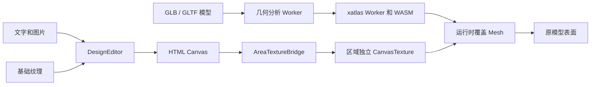

<div align="center">


<h1>CustomForge</h1>

<hr>

<p><strong>让二维纹理画布实时呈现在三维产品上</strong></p>

<p>一个轻量、与前端框架无关的产品定制工具，基于 Fabric.js 和 Three.js 构建浏览器端 2D 到 3D 定制体验</p>

<p>
  <a href="./README.md">English</a>
  <span> · </span>
  <strong>简体中文</strong>
</p>

<p>
  
  
  
  
  
</p>

</div>

---

## 项目能力

CustomForge 将受支持的静态三维模型自动转换为一个或多个浏览器设计区域：

- 在二维纹理画布上添加和编辑文字
- 上传、移动、缩放和旋转图片
- 将画布的每次变化实时呈现在三维产品上
- 加载远程 GLB/GLTF 模型或本地自包含 GLB 文件
- 在模型没有现成 UV 和指定 Mesh 时自动分析几何并生成候选设计区域
- 在 Worker 中使用 xatlas 参数化候选区域，同时保留原模型材质
- 独立编辑、切换、缩放和平移多个设计区域
- 使用 OrbitControls 旋转和缩放三维预览
- 将合成后的纹理导出为 PNG
- 通过版本化 Design JSON 保存和恢复可编辑对象
- 通过名称、显隐、锁定和顺序管理对象图层
- 使用设计快照撤销和重做修改
- 使用可配置的文字、背景和装饰素材 Dialog
- 通过品牌、文案、主题变量和图标适配默认 Workbench

工作台内置了一个程序生成的杯子，无需准备外部资源即可直接运行

## 仓库开发

环境要求：Node.js 22+ 和 pnpm 11+

```bash
pnpm install
pnpm dev
```

打开 Vite 输出的地址

内置演示的左侧是 UV 编辑区，右侧是实时三维预览

## npm Alpha 制品

CustomForge 已通过 `alpha` dist-tag 发布到 npm Registry，不同 alpha 版本之间的 API 和 Design JSON Schema 可能发生变化

使用以下命令安装当前公开 alpha：

```powershell
pnpm add customforge@alpha
```

Fabric.js、Three.js 和 xatlas 运行时会作为传递依赖自动安装

pnpm 可能提示可选的原生 `canvas` 构建脚本已被忽略，CustomForge 运行在浏览器中，不使用 Node 原生 canvas，因此不需要执行 `pnpm approve-builds`

消费项目可以在 `package.json` 中明确记录这一浏览器端选择：

```json
{
  "pnpm": {
    "ignoredBuiltDependencies": ["canvas"]
  }
}
```

包页面：[npmjs.com/package/customforge](https://www.npmjs.com/package/customforge)

发布前如需进行独立于仓库源码的验证，可在仓库根目录构建并生成本地包：

```powershell
pnpm pack:local
```

命令依次生成 JavaScript、TypeScript 声明和公开样式，检查 npm 文件清单，并创建：

```text
customforge-0.1.0-alpha.2.tgz
```

在独立 Vite TypeScript 项目中安装该本地制品：

```powershell
pnpm add D:\projects\3DRendering\core_code\customforge-0.1.0-alpha.2.tgz
```

仓库中的 `examples/npm-consumer` 提供了一个只通过该 `.tgz` 导入的消费示例。在该目录中使用 `pnpm install --ignore-workspace`，确保 pnpm 将其作为独立于父级 workspace 的项目安装

## 加载你的产品

在演示页面中选择 **Load product**。默认选中自动模式：

| 字段 | 用途 |
| --- | --- |
| GLB / GLTF URL | 受支持的静态三角形模型地址 |
| Local GLB file | 从当前设备选择的自包含 `.glb` 文件 |
| Design area mode | 自动几何处理或 existing-UV 兼容模式 |
| Base texture URL | 显示在可编辑对象下方的可选基础纹理 |
| Design guide template URL | 只在编辑器显示且不进入纹理或 PNG 的可选 SVG / PNG 模板 |
| Customizable mesh | 仅 existing-UV 模式使用，指定接收实时纹理的 Mesh |
| Flip texture vertically | 仅 existing-UV 模式使用，修正模型纹理方向 |
| Show UV island boundaries | 自动显示目标 Mesh 的 UV 岛边界 |

自动模式会在独立 Worker 中分析静态 Mesh 几何，使用包内的 xatlas Worker 和 WASM 模块生成局部 UV，并创建透明的运行时覆盖 Mesh。它不会重写上传的 GLB，也不会替换来源材质

xatlas 启动前，CustomForge 会在页面上下文获取并校验包内 WASM 资源，再通过本地 `application/wasm` Blob URL 提供给 Worker。请求失败、响应内容无效或初始化超过 15 秒时，产品加载会返回明确错误，不会一直停留在 0%

系统默认打开评分最高的区域。Workbench 可以通过区域下拉框、上一个/下一个按钮和三维表面选择模式切换候选。当前表面选择会切换到包含命中三角形的已有候选，找不到时选择该 Mesh 上评分最高的候选；暂时不会从每次点击位置生长一个全新任意区域

existing-UV 模式继续服务于经过专业预处理的模型，需要带有效 UV 的命名 Mesh，并把编辑器纹理直接应用到该 Mesh

> [!IMPORTANT]
> 远程模型、纹理、贴图和字体必须提供允许当前页面来源访问的 CORS 响应头
>
> 被浏览器阻止或污染 Canvas 的资源可能无法加载，也会导致 PNG 导出失败

## 基本用法

与框架无关的 Library 入口可以挂载到任意两个 DOM 容器中：

CustomForge 仅支持浏览器环境，应在 DOM 挂载容器可用后创建实例

编辑器和查看器必须使用两个不同的容器；页面卸载、组件卸载或不再使用实例时必须调用 `destroy()` 释放 Fabric、WebGL、观察器和事件资源

```html
<div id="texture-editor"></div>
<div id="product-viewer"></div>
```

```ts
import { createCustomizer } from 'customforge'
import 'customforge/style.css'

const customizer = await createCustomizer({
  editor: '#texture-editor',
  viewer: '#product-viewer',
  editorWidth: 1024,
  editorHeight: 512,
  product: {
    modelUrl: 'https://example.com/product.glb',
    designAreas: {
      mode: 'auto',
      maxAreas: 4,
      textureSize: 1024,
      strategy: 'balanced',
    },
    designGuide: {
      showUv: true,
    },
  },
})

customizer.addText({
  text: 'Hello world',
  x: 120,
  y: 180,
  fontSize: 64,
  color: '#172126',
})

await customizer.addImage({
  src: 'https://example.com/logo.png',
  x: 720,
  y: 240,
  width: 220,
})

window.addEventListener('beforeunload', () => customizer.destroy(), {
  once: true,
})
```

公开包与本地 `.tgz` 使用相同的根入口和样式入口；需要可重复安装时应固定具体 alpha 版本

## 开箱即用的 Workbench

不希望从零编写控制界面时，可以使用可选的 Workbench 入口

挂载元素必须设置明确高度，设计画布、图层面板和三维区域才能正确计算可用空间

```html
<div id="customforge-workbench" style="height: 720px"></div>
```

```ts
import { createWorkbench } from 'customforge/workbench'
import 'customforge/style.css'

const workbench = await createWorkbench({
  container: '#customforge-workbench',
  product: {
    modelUrl: 'https://example.com/product.glb',
  },
  features: {
    presetBackgrounds: true,
    presetElements: true,
  },
  layout: {
    header: true,
    layers: true,
  },
  branding: {
    logoUrl: '/brand/logo.png',
    title: '定制工作室',
    subtitle: '产品个性化设计',
  },
  labels: {
    addText: '文字设计',
    addImage: '图片素材',
  },
  theme: {
    accent: '#0057b8',
    accentHover: '#003f87',
    accentContrast: '#ffffff',
  },
  assets: {
    backgrounds: [
      { id: 'floral', name: '花卉背景', url: '/presets/floral.png' },
    ],
    elements: [
      { id: 'flower', name: '小花', url: '/presets/flower.png' },
    ],
  },
})
```

默认使用包内的 CustomForge Logo，可以通过 `branding` 替换或隐藏

`labels` 用于替换 Workbench 可见文案，`theme` 映射到限定作用域的 CSS 变量，`icons` 可以关闭内置图标或用图片地址替换指定语义图标

默认界面字体栈优先使用圆润的 `Nunito Sans`，不可用时回退到系统无衬线字体

CustomForge 会随制品提供该字体资源，不会在运行时请求第三方字体服务

文字和图片命令现在会打开专用 Dialog，不会在点击工具栏按钮后立即修改画布

- 文字 Dialog 提供文本输入、颜色选择和可替换的排版预设
- 图片 Dialog 提供本地上传、预设背景和装饰元素
- 设计背景会替换已有设计背景、铺满画布、默认锁定在最底层并保存到 Design JSON
- 产品 Dialog 可以选择远程地址或本地 GLB，并提供自动与 existing-UV 模式
- 编辑器标题区支持区域切换、放大、缩小、适配、100%、滚轮缩放、中键拖动和空格加拖动平移；100% 保留当前位置，适配会重新居中

功能和布局开关也可以在初始化后动态调整

```ts
workbench.setFeature('addText', true)
workbench.setLayout('header', true)
```

| 功能开关 | 控制内容 |
| --- | --- |
| `addText`、`addImage`、`deleteSelection` | 对象 Dialog 和删除操作 |
| `undoRedo` | 撤销、重做按钮和 Workbench 键盘快捷键 |
| `saveDesign`、`loadDesign` | Design JSON 操作 |
| `loadRemoteProduct`、`exportTexture`、`resetView` | 产品和输出操作 |
| `designGuide` | 产品模板、UV、安全区和出血区辅助层开关 |
| `designAreas` | 区域选择器和上一个/下一个控件 |
| `editorViewport` | 缩放、适配和 100% 编辑器控件 |
| `surfacePick` | 从三维表面选择候选区域 |
| `reorderObjects`、`toggleObjectVisibility`、`lockObjects`、`renameObjects` | 图层管理 |
| `presetBackgrounds`、`presetElements` | 图片 Dialog 中的预设素材页签 |

| 布局开关 | 控制区域 |
| --- | --- |
| `header` | 品牌和全局产品操作 |
| `editorHeader`、`viewerHeader` | 工作区面板标题栏 |
| `toolbar` | 设计工具栏 |
| `layers` | 对象图层面板 |
| `status` | 运行状态和对象数量 |

所有功能和布局开关默认均为 `true`

功能开关只控制 Workbench 自带控件，不会移除 `workbench.customizer` 上的底层方法

主题配置用于统一的产品级视觉调整，不提供难以维护的逐按钮颜色配置

```ts
const workbench = await createWorkbench({
  container: '#customforge-workbench',
  icons: {
    enabled: true,
    sources: {
      addText: '/icons/typography.svg',
      exportTexture: null,
    },
  },
  textPresets: [
    {
      id: 'brand-display',
      name: '品牌展示',
      fontFamily: 'Arial',
      fontSize: 72,
      width: 460,
      color: '#17191c',
    },
  ],
})
```

## Design JSON

`saveDesign()` 返回由 Library 自身定义、可安全写入 JSON 的文档，不暴露 Fabric.js 序列化格式。`loadDesign()` 校验未知输入，并异步恢复可编辑对象栈：

```ts
const design = customizer.saveDesign()
localStorage.setItem('customforge-design', JSON.stringify(design))

const savedDesign = localStorage.getItem('customforge-design')
if (savedDesign) {
  await customizer.loadDesign(JSON.parse(savedDesign))
}
```

`saveDesign()` 现在返回产品 Design JSON version `2`，保存模型指纹、自动处理器版本、活动区域以及每个区域独立的 version 1 画布文档。对象仍按从后到前的顺序保存，并包含稳定 ID、名称、显隐、锁定状态、图片用途与基于中心点的变换

Version 2 有意排除模型字节、来源材质和基础纹理。加载时要求逻辑画布尺寸、自动处理器版本、模型指纹、区域 ID 和区域指纹一致，避免设计静默映射到另一个模型或另一版处理结果

带有 `role: 'background'` 的图片是设计对象，不是产品基础纹理，只允许存在一个并且必须位于对象数组首位，旧版 v1 文档缺少 `role` 时继续按普通图片元素加载

加载事务覆盖全部区域：校验或图片加载失败时会恢复旧画布、活动区域、视口、辅助层、纹理和历史。Blob URL 图片会在添加时转换为 Data URL；远程图片仍保留 URL，恢复时必须继续满足浏览器 CORS 要求

旧的 version 1 单画布文档仍可加载到当前活动区域，再次保存时会生成 version 2。这是自动多区域功能上线前已有设计的迁移路径

该 Schema 目前仍属于 alpha 契约，后续 alpha 版本可能调整

## 产品设计辅助层

`product.designGuide` 用于向二维编辑器提供不会进入最终输出的定位信息：

- `showUv` 默认开启，从目标 Mesh 自动提取 UV 岛边界，不绘制三角形内部共享边
- `templateUrl` 接受覆盖整个画布的透明 SVG 或 PNG，远程地址必须允许 CORS
- `safeArea` 使用虚线提示重要内容的推荐范围
- `bleedArea` 使用实线提示包含裁切余量的范围
- `visible` 控制产品初次加载时是否显示辅助层

`safeArea` 和 `bleedArea` 使用 `0-1` 归一化坐标，不依赖编辑器分辨率，仍然只提供视觉提示而不限制对象。自动模式的运行时覆盖 Mesh 只包含候选三角形，因此透明像素和生成 UV 区域之外的内容不会修改不相关的模型表面

```ts
customizer.setDesignGuideVisible(false)
console.log(customizer.isDesignGuideVisible())
```

只要传入模型且不提供 `surfaceMesh`，省略 `designAreas` 也会使用相同的自动默认值。需要保留原有直接 UV 行为时显式选择兼容模式：

```ts
await customizer.loadProduct({
  modelUrl: 'https://example.com/prepared-product.glb',
  surfaceMesh: 'PrintArea',
  designAreas: { mode: 'existing-uv' },
  textureFlipY: false,
})
```

## 撤销与重做

无界面核心和 Workbench 都支持历史记录，默认保留 50 个撤销步骤

可以在 `createCustomizer` 或 `createWorkbench` 配置中通过 `historyLimit` 调整保留的撤销深度

```ts
if (customizer.canUndo()) {
  await customizer.undo()
}

await customizer.redo()
customizer.clearHistory()

const stop = customizer.on('historychange', ({ canUndo, canRedo }) => {
  console.log({ canUndo, canRedo })
})
```

历史记录覆盖对象添加、删除、画布变换、文字编辑、图层排序、名称、显隐、锁定和 Design JSON 加载。每个设计区域在切换到其他区域后仍保留自己的撤销与重做栈

Workbench 在焦点不位于表单控件时支持 `Ctrl` 或 `Cmd` + `Z`、`Ctrl` 或 `Cmd` + `Shift` + `Z` 和 `Ctrl` + `Y`

成功更换产品后会保留当前设计对象，但以当前设计重新开始历史记录

## 实例 API

| 方法 | 说明 |
| --- | --- |
| `addText(options)` | 添加并选中文字，自动约束在画布内 |
| `addImage(options)` | 加载普通图片元素或替换设计背景 |
| `getObjects()` | 按从后到前的图层顺序返回当前对象 |
| `getSelectedObjectIds()` | 返回当前选区中的稳定对象 ID |
| `selectObject(id)` | 根据稳定 ID 选中可见对象 |
| `removeObject(id)` | 根据稳定 ID 删除对象 |
| `moveObject(id, index)` | 将对象移动到从 0 开始的图层索引 |
| `renameObject(id, name)` | 修改图层工具中显示的对象名称 |
| `setObjectVisibility(id, visible)` | 设置对象是否参与渲染 |
| `setObjectLocked(id, locked)` | 锁定或解锁画布变换 |
| `isDesignGuideVisible()` | 查询产品设计辅助层是否显示 |
| `setDesignGuideVisible(visible)` | 显示或隐藏产品设计辅助层 |
| `getDesignAreas()` | 返回自动生成的区域和质量指标 |
| `getActiveDesignAreaId()` | 返回二维编辑器当前加载的区域 |
| `setActiveDesignArea(areaId)` | 保存当前区域并恢复另一个区域 |
| `isSurfacePickAllowed()` | 查询当前产品是否允许从三维表面选择候选区域 |
| `beginSurfacePick()`、`cancelSurfacePick()` | 开始或结束从三维模型选择候选区域 |
| `getEditorViewport()` | 返回活动区域的缩放和平移状态 |
| `setEditorViewport(viewport)` | 只修改显示缩放和平移，不改变输出坐标 |
| `fitActiveDesignArea()` | 适配活动区域并清除显示平移 |
| `deleteSelected()` | 删除当前对象或选区 |
| `saveDesign()` | 返回当前版本化 Design JSON 文档 |
| `loadDesign(value)` | 校验并以事务方式恢复 Design JSON |
| `canUndo()`、`canRedo()` | 查询当前可用的历史方向 |
| `undo()`、`redo()` | 恢复前一个或后一个设计快照 |
| `clearHistory()` | 将当前设计设为新的历史起点 |
| `loadProduct(product)` | 更换模型、基础纹理和目标 Mesh |
| `exportTexture(filename?)` | 将合成纹理下载为 PNG |
| `resetView()` | 恢复默认三维相机位置 |
| `on(event, listener)` | 订阅实例事件，并返回取消订阅函数 |
| `destroy()` | 释放 DOM 事件、Fabric 状态和 WebGL 资源 |

当前事件包括 `ready`、`change`、`selectionchange`、`historychange`、`designguidechange`、`processingprogress`、`designareaschange`、`activeareachange`、`surfacepickchange`、`editorviewportchange`、`status` 和 `error`

首个 alpha 的稳定候选边界只包括上表方法、`createCustomizer`、`ProductCustomizer`、`customforge/workbench` 入口，以及从已声明入口导出的配置、事件、Workbench 和 Design JSON 类型

`ProductCustomizer` 不公开 Fabric.js 编辑器和 Three.js 查看器实例，使用方只通过门面 API 操作定制器

不支持从 `core`、`editor`、`viewer`、`bridge` 或其他未声明的包子路径导入模块

## 架构



```text
ProductCustomizer
|-- DesignEditor      Fabric.js 渲染和对象交互
|-- Processing        几何快照、Worker 分析和 xatlas UV
|-- ProductViewer     Three.js 场景、模型、材质和相机
`-- AreaTextureBridge 区域画布到覆盖 Mesh 的独立同步
```

`ProductCustomizer` 负责协调各模块，并将 Fabric.js 和 Three.js 的实现细节隐藏在小型实例 API 后面

可选 Workbench 和演示界面使用原生 TypeScript，核心不依赖 Vue、React 或其他 UI 框架

## 模型约定

自动模式当前支持：

- 静态三角形 `Mesh`，原始 UV 可以不存在
- 远程 GLB/GLTF 地址或本地自包含 GLB 文件
- 标准 Three.js `GLTFLoader` 可以直接加载的未压缩资源
- 浏览器可以在 CORS 策略下访问远程资源地址

自动路径暂不支持 `SkinnedMesh`、`InstancedMesh`、正在参与形变的 Morph Target、本地多文件 GLTF，以及需要但未配置 Draco 或 Meshopt 解码器的模型。受当前 xatlas 包装器限制，候选输入和生成后的覆盖几何最多支持 65,535 个顶点

existing-UV 模式另外要求带有效 UV 的命名三角形 Mesh，并使用它的第一个材质槽。内置程序模型遵循这一 `PrintArea` 兼容路径

## 项目结构

```text
src/
|-- bridge/           Canvas 与 Three.js 纹理同步
|-- core/             公共类型、配置和 DOM 工具
|-- customizer/       公共实例编排
|-- design-area/      覆盖几何和 xatlas 参数化
|-- demo/             可运行的工作台界面
|-- editor/           Fabric.js 设计画布和快照历史
|-- processing/       可转移几何分析和 Worker 生命周期
|-- style.css         Library 公开样式入口
|-- styles/           核心和 Workbench 样式
|-- viewer/           Three.js 产品预览
|-- workbench/        可配置界面、Dialog、图标和预设素材
`-- index.ts          与框架无关的源码入口

examples/
`-- npm-consumer/     本地 .tgz 独立消费示例

scripts/
`-- verify-package.mjs  npm 文件和制品边界检查
```

## 开发命令

```bash
pnpm check       # TypeScript 项目检查
pnpm test        # 单元测试
pnpm build       # 类型检查和生产构建
pnpm build:lib   # 构建核心与 Workbench ESM、类型声明和样式
pnpm verify:package # 检查 dist 和 npm 文件清单
pnpm pack:local  # 构建、检查并生成本地 .tgz
pnpm release:check # 执行检查、测试、制品构建、校验和本地打包
pnpm preview     # 预览生产构建
```

## 当前范围

这是一个早期技术原型

公共 API 和设计文档格式尚未稳定

当前里程碑实现了自动候选生成、独立多区域纹理、每区域历史和 Design JSON version 2，同时保留 existing-UV 兼容路径

在 API 和 Design JSON 契约进入更稳定阶段前，公开 npm 版本统一使用 `alpha` dist-tag

当前表面拾取只会切换已有候选，还不会从每个点击三角形生长新区域。可见度采样、畸变与重叠质量门槛、持久缓存、触屏双指手势、BVH 加速、压缩模型解码器和框架适配器仍属于后续工作

## 技术栈

- [Fabric.js](https://fabricjs.com/)：二维编辑画布
- [Three.js](https://threejs.org/)：模型加载和实时三维渲染
- [xatlas-three](https://github.com/repalash/xatlas-three) 和 [xatlasjs](https://github.com/repalash/xatlas.js)：Worker/WASM UV 参数化
- [Lucide](https://lucide.dev/)：打包到 Workbench 中的界面图标
- [Vite](https://vite.dev/)：开发环境和应用构建
- [TypeScript](https://www.typescriptlang.org/)：启用严格类型检查

## 开源协议

CustomForge 依据 Apache License 2.0 开源

完整协议内容请参阅 [LICENSE](./LICENSE)

第三方依赖和资产仍遵循各自的许可条款

随包提供的 Nunito Sans 字体遵循 SIL Open Font License 1.1，完整条款见 [NunitoSans-OFL.txt](./LICENSES/NunitoSans-OFL.txt)

xatlas-three 和 xatlasjs 使用 MIT License，完整文本见 [xatlas-three-MIT.txt](./LICENSES/xatlas-three-MIT.txt) 与 [xatlasjs-MIT.txt](./LICENSES/xatlasjs-MIT.txt)。捆绑的 Comlink 代码在 [Comlink-Apache-2.0-NOTICE.txt](./LICENSES/Comlink-Apache-2.0-NOTICE.txt) 中保留 Apache 2.0 归属声明
