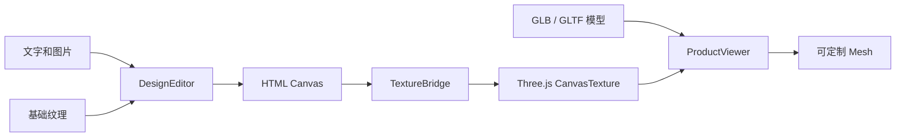

<div align="center">

# CustomForge

**让二维纹理画布实时呈现在三维产品上**

一个轻量、与前端框架无关的产品定制原型，基于 Fabric.js 和 Three.js 构建浏览器端 2D 到 3D 定制体验

<p>
  
  
  
  
  
</p>

<p>
  <a href="./README.md">English</a> |
  <strong>中文简体</strong>
</p>

</div>

---

## 项目能力

CustomForge 将常见的二维设计界面与带 UV 的三维模型连接起来：

- 在二维纹理画布上添加和编辑文字
- 上传、移动、缩放和旋转图片
- 将画布的每次变化实时呈现在三维产品上
- 加载远程 GLB/GLTF 模型和可选的基础纹理
- 通过 Mesh 名称指定可定制表面
- 使用 OrbitControls 旋转和缩放三维预览
- 将合成后的纹理导出为 PNG
- 通过版本化 Design JSON 保存和恢复可编辑对象

工作台内置了一个程序生成的杯子，无需准备外部资源即可直接运行

## 仓库开发

环境要求：Node.js 22+ 和 pnpm 11+

```bash
pnpm install
pnpm dev
```

打开 Vite 输出的地址

内置演示的左侧是 UV 编辑区，右侧是实时三维预览

## npm Alpha 制品

CustomForge 已通过 `alpha` dist-tag 发布到 npm Registry，不同 alpha 版本之间的 API 和 Design JSON Schema 可能发生变化

使用以下命令安装当前公开 alpha：

```powershell
pnpm add customforge@alpha
```

Fabric.js 和 Three.js 会作为传递依赖自动安装

pnpm 可能提示可选的原生 `canvas` 构建脚本已被忽略，CustomForge 运行在浏览器中，不使用 Node 原生 canvas，因此不需要执行 `pnpm approve-builds`

消费项目可以在 `package.json` 中明确记录这一浏览器端选择：

```json
{
  "pnpm": {
    "ignoredBuiltDependencies": ["canvas"]
  }
}
```

包页面：[npmjs.com/package/customforge](https://www.npmjs.com/package/customforge)

发布前如需进行独立于仓库源码的验证，可在仓库根目录构建并生成本地包：

```powershell
pnpm pack:local
```

命令依次生成 JavaScript、TypeScript 声明、核心样式，检查 npm 文件清单，并创建：

```text
customforge-0.1.0-alpha.1.tgz
```

在独立 Vite TypeScript 项目中安装该本地制品：

```powershell
pnpm add D:\projects\3DRendering\core_code\customforge-0.1.0-alpha.1.tgz
```

仓库中的 `examples/npm-consumer` 提供了一个只通过该 `.tgz` 导入的消费示例。在该目录中使用 `pnpm install --ignore-workspace`，确保 pnpm 将其作为独立于父级 workspace 的项目安装

## 加载你的产品

在演示页面中选择 **Load remote**，然后填写：

| 字段 | 用途 |
| --- | --- |
| GLB / GLTF URL | 带 UV 的三维产品模型地址 |
| Base texture URL | 显示在可编辑对象下方的可选基础纹理 |
| Customizable mesh | 接收实时画布纹理的 Mesh 名称 |
| Flip texture vertically | 在模型需要时修正纹理的垂直方向 |

UV 坐标应当保存在三维模型中

可选的纹理图片只是二维编辑器的基础图层，不能替代模型中的 UV 数据

> [!IMPORTANT]
> 远程模型、纹理、贴图和字体必须提供允许当前页面来源访问的 CORS 响应头
>
> 被浏览器阻止或污染 Canvas 的资源可能无法加载，也会导致 PNG 导出失败

## 基本用法

与框架无关的 Library 入口可以挂载到任意两个 DOM 容器中：

CustomForge 仅支持浏览器环境，应在 DOM 挂载容器可用后创建实例

编辑器和查看器必须使用两个不同的容器；页面卸载、组件卸载或不再使用实例时必须调用 `destroy()` 释放 Fabric、WebGL、观察器和事件资源

```html
<div id="texture-editor"></div>
<div id="product-viewer"></div>
```

```ts
import { createCustomizer } from 'customforge'
import 'customforge/style.css'

const customizer = await createCustomizer({
  editor: '#texture-editor',
  viewer: '#product-viewer',
  editorWidth: 1024,
  editorHeight: 512,
  product: {
    modelUrl: 'https://example.com/product.glb',
    textureUrl: 'https://example.com/base-texture.png',
    surfaceMesh: 'PrintArea',
    textureFlipY: false,
  },
})

customizer.addText({
  text: 'Hello world',
  x: 120,
  y: 180,
  fontSize: 64,
  color: '#172126',
})

await customizer.addImage({
  src: 'https://example.com/logo.png',
  x: 720,
  y: 240,
  width: 220,
})

window.addEventListener('beforeunload', () => customizer.destroy(), {
  once: true,
})
```

公开包与本地 `.tgz` 使用相同的根入口和样式入口；需要可重复安装时应固定具体 alpha 版本

## Design JSON

`saveDesign()` 返回由 Library 自身定义、可安全写入 JSON 的文档，不暴露 Fabric.js 序列化格式。`loadDesign()` 校验未知输入，并异步恢复可编辑对象栈：

```ts
const design = customizer.saveDesign()
localStorage.setItem('customforge-design', JSON.stringify(design))

const savedDesign = localStorage.getItem('customforge-design')
if (savedDesign) {
  await customizer.loadDesign(JSON.parse(savedDesign))
}
```

当前 Schema 版本为 `1`。文档保存逻辑画布尺寸，并按从后到前的渲染顺序保存文字和图片对象，包括稳定对象 ID 与基于中心点的变换

Design JSON 有意排除产品模型、目标 Mesh 和基础纹理。文档只能加载到逻辑宽高完全相同的编辑器中

加载具有事务性：只有文档校验通过且全部引用图片成功加载后，当前设计才会被替换。Blob URL 图片会在添加时转换为 Data URL；远程图片仍保留 URL，恢复时必须继续满足浏览器 CORS 要求

该 Schema 目前仍属于 alpha 契约，后续 alpha 版本可能调整

## 实例 API

| 方法 | 说明 |
| --- | --- |
| `addText(options)` | 添加并选中文字，自动约束在画布内 |
| `addImage(options)` | 加载并选中图片，自动约束在画布内 |
| `deleteSelected()` | 删除当前对象或选区 |
| `saveDesign()` | 返回当前版本化 Design JSON 文档 |
| `loadDesign(value)` | 校验并以事务方式恢复 Design JSON |
| `loadProduct(product)` | 更换模型、基础纹理和目标 Mesh |
| `exportTexture(filename?)` | 将合成纹理下载为 PNG |
| `resetView()` | 恢复默认三维相机位置 |
| `on(event, listener)` | 订阅实例事件，并返回取消订阅函数 |
| `destroy()` | 释放 DOM 事件、Fabric 状态和 WebGL 资源 |

当前事件包括 `ready`、`change`、`selectionchange`、`status` 和 `error`

首个 alpha 的稳定候选边界只包括上表方法、`createCustomizer`、`ProductCustomizer` 以及从根入口导出的配置、事件和 Design JSON 类型

`ProductCustomizer` 不公开 Fabric.js 编辑器和 Three.js 查看器实例，使用方只通过门面 API 操作定制器

不支持从 `core`、`editor`、`viewer`、`bridge` 或其他未声明的包子路径导入模块

## 架构



```text
ProductCustomizer
|-- DesignEditor      Fabric.js 渲染和对象交互
|-- ProductViewer     Three.js 场景、模型、材质和相机
`-- TextureBridge     Canvas 到材质的同步
```

`ProductCustomizer` 负责协调各模块，并将 Fabric.js 和 Three.js 的实现细节隐藏在小型实例 API 后面

演示界面使用原生 TypeScript，核心不依赖 Vue、React 或其他 UI 框架

## 模型约定

当前原型要求：

- GLB 或 GLTF 模型包含有效的 UV 坐标
- 模型未经压缩，能够由标准 Three.js `GLTFLoader` 直接加载
- 模型具有一个用于定制表面的命名 Mesh，例如 `PrintArea`
- 目标纹理位于该 Mesh 的第一个材质槽中
- 浏览器可以在 CORS 策略下访问远程资源地址

内置演示同样遵循 `PrintArea` Mesh 命名约定

## 项目结构

```text
src/
|-- bridge/           Canvas 与 Three.js 纹理同步
|-- core/             公共类型、配置和 DOM 工具
|-- customizer/       公共实例编排
|-- demo/             可运行的工作台界面
|-- editor/           Fabric.js 设计画布
|-- style.css         Library 公开样式入口
|-- styles/           Library 核心样式
|-- viewer/           Three.js 产品预览
`-- index.ts          与框架无关的源码入口

examples/
`-- npm-consumer/     本地 .tgz 独立消费示例

scripts/
`-- verify-package.mjs  npm 文件和制品边界检查
```

## 开发命令

```bash
pnpm check       # TypeScript 项目检查
pnpm test        # 单元测试
pnpm build       # 类型检查和生产构建
pnpm build:lib   # 构建 ESM、类型声明和核心样式
pnpm verify:package # 检查 dist 和 npm 文件清单
pnpm pack:local  # 构建、检查并生成本地 .tgz
pnpm release:check # 执行检查、测试、制品构建、校验和本地打包
pnpm preview     # 预览生产构建
```

## 当前范围

这是一个早期技术原型

公共 API 和设计文档格式尚未稳定

当前里程碑有意聚焦于一张纹理和一个可定制 Mesh

在 API 和 Design JSON 契约进入更稳定阶段前，公开 npm 版本统一使用 `alpha` dist-tag

多定制面、撤销与重做和框架适配器仍未实现。撤销与重做是下一阶段计划，并将复用 Design JSON 快照契约

## 技术栈

- [Fabric.js](https://fabricjs.com/)：二维编辑画布
- [Three.js](https://threejs.org/)：模型加载和实时三维渲染
- [Vite](https://vite.dev/)：开发环境和应用构建
- [TypeScript](https://www.typescriptlang.org/)：启用严格类型检查

## 开源协议

CustomForge 依据 Apache License 2.0 开源

完整协议内容请参阅 [LICENSE](./LICENSE)

第三方依赖和资产仍遵循各自的许可条款
